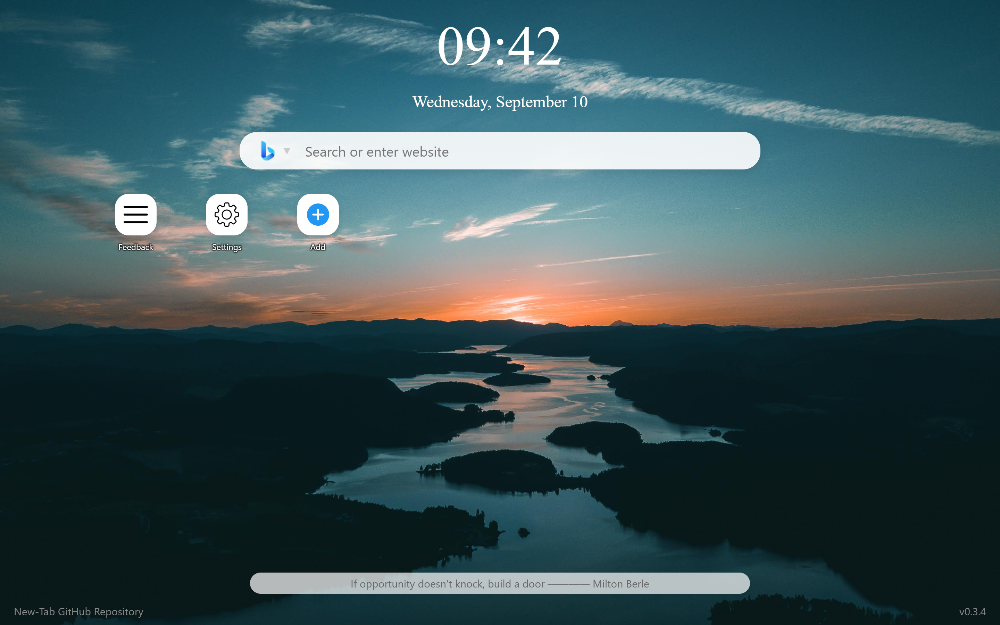
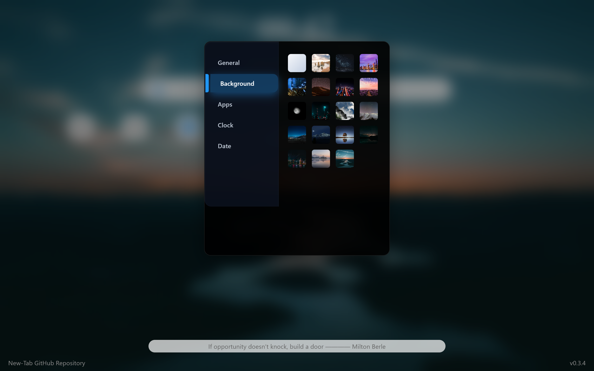

# New Tab v0.4.0

**Available Languages**:  

A modern open-source new tab page for personalized browsing experience.

## ✨ Features
- Customizable layouts and themes
- Responsive design
- Quick access
- Buildin backgrounds
- Quick search functionality
- Motto
- Todo list
- Weather widget (coming soon!)

## 🚀 Quick Start
1. Download the extension from `Edge Add-ons ` or the released `.zip` file
2. To install the extension from `.zip` file, extract the file, go in to the extension settings in your browser, turn on developer mode, select load unpacked and choose the folder extracted. 
3. Start using your personalised new tab

## 🖼️ Screenshots
| Feature | Preview |
|------|------|
| Main Interface |  |
| Multi-backgrounds |  |

## 👥 Contributing
Project is still in developing stage. Contributions are highly welcome! Please follow these steps:
1. Fork the repository
2. Create a new branch (`git checkout -b feature/your-feature`)
3. Commit your changes (`git commit -m 'Add some feature'`)
4. Push to the branch (`git push origin feature/your-feature`)
5. Create a Pull Request
(Remember to add neccessery comment.)

## 📄 License
This project is licensed under the [MIT License](LICENSE).
