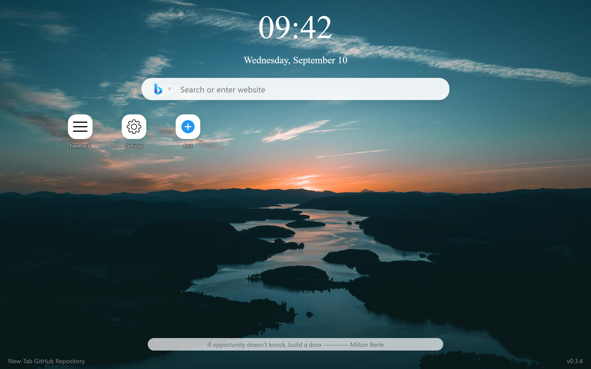
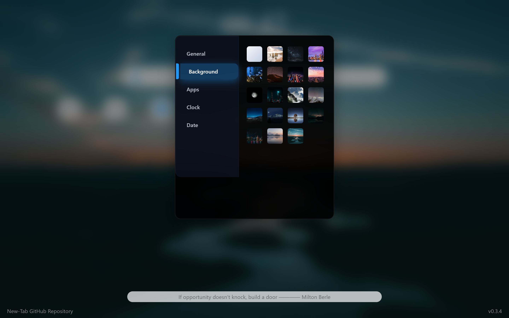

# New Tab v0.3.9

A modern open-source new tab page for personalized browsing experience.

## ✨ Features
- Customizable layouts and themes
- Responsive design
- Quick access
- Buildin backgrounds
- Quick search functionality
- Motto
- Weather widget (coming soon!)
- Todo list (coming soon!)

## 🚀 Quick Start
1. Download the released source code
2. Open the `New-Tab.html` file using a browser
3. Copy the path at the top
4. Paste them into the Start-up page path and the home page path in the browser settings
5. Start using your personalised new tab

## 🖼️ Screenshots
| Feature | Preview |
|------|------|
| Main Interface |  |
| Multi-backgrounds |  |

## 👥 Contributing
Project is still in developing stage. Contributions are highly welcome! Please follow these steps:
1. Fork the repository
2. Create a new branch (`git checkout -b feature/your-feature`)
3. Commit your changes (`git commit -m 'Add some feature'`)
4. Push to the branch (`git push origin feature/your-feature`)
5. Create a Pull Request
(Remember to add neccessery comment.)

## 📄 License
This project is licensed under the [MIT License](LICENSE).
