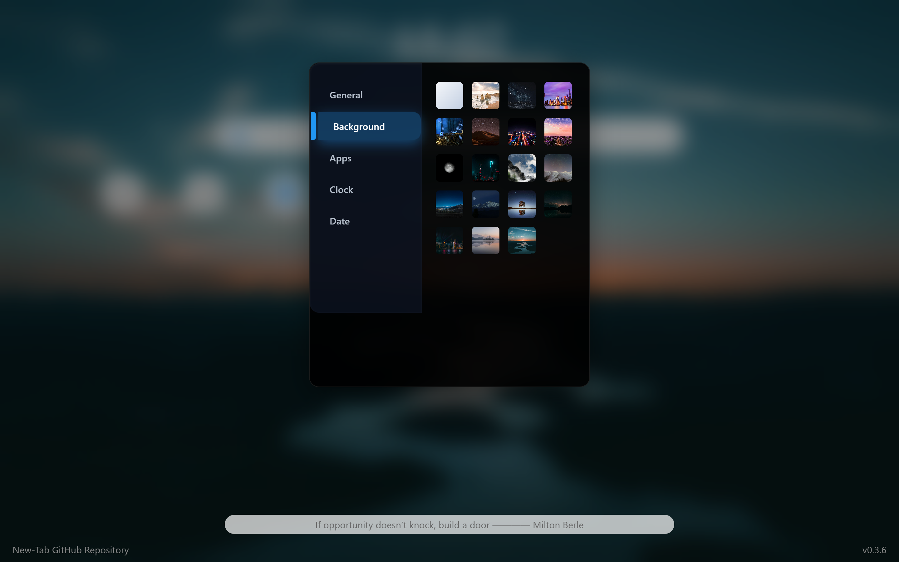

# New Tab v0.3.6

现代化的开源新标签页，提供个性化浏览体验。

## ✨ 功能
- 可定制布局和主题
- 响应式设计
- 快捷访问
- 内置背景
- 快速搜索功能
- 格言
- 天气组件（即将推出！）
- 待办清单（即将推出！）

## 🚀 快速开始
1. 下载发布的源代码
2. 使用浏览器打开 `New-Tab.html` 文件
3. 复制顶部的路径
4. 将其粘贴到浏览器设置中的启动页路径和主页路径中
5. 开始使用您的个性化新标签页

## 🖼️ 截图
| 功能 | 预览 |
|------|------|
| 主界面 |  |
| 多背景支持 |  |

## 👥 贡献指南
项目仍处于开发阶段。欢迎大家贡献代码！请按以下步骤操作：
1. Fork 本仓库
2. 创建新分支 (`git checkout -b feature/your-feature`)
3. 提交更改 (`git commit -m '添加新功能'`)
4. 推送分支 (`git push origin feature/your-feature`)
5. 创建 Pull Request
(记得添加必要的注释)

## 📄 许可协议
本项目基于 [MIT 许可协议](../LICENSE)。
